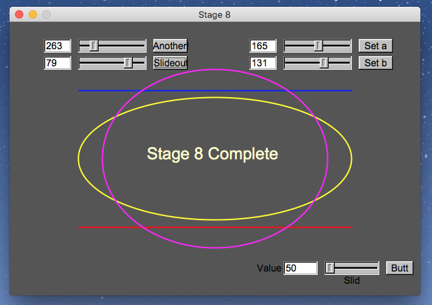

# fltk-basics

In chapters 12-16 of Bjarne Stroustrup's Programming Principles and Practice we are directed to install FLTK, a GUI toolkit. We are then instructed to download some "simple interface classes" to help us use the toolkit. [FLTK](www.fltk.org) is available from its site and the extra interface classes are found on the [PPP support site](http://www.stroustrup.com/Programming/Graphics/).

This repository is an attempt to rebuild parts of those support classes as a means to better learn C++ and the FLTK library.

The final result of this repo produces the following:

